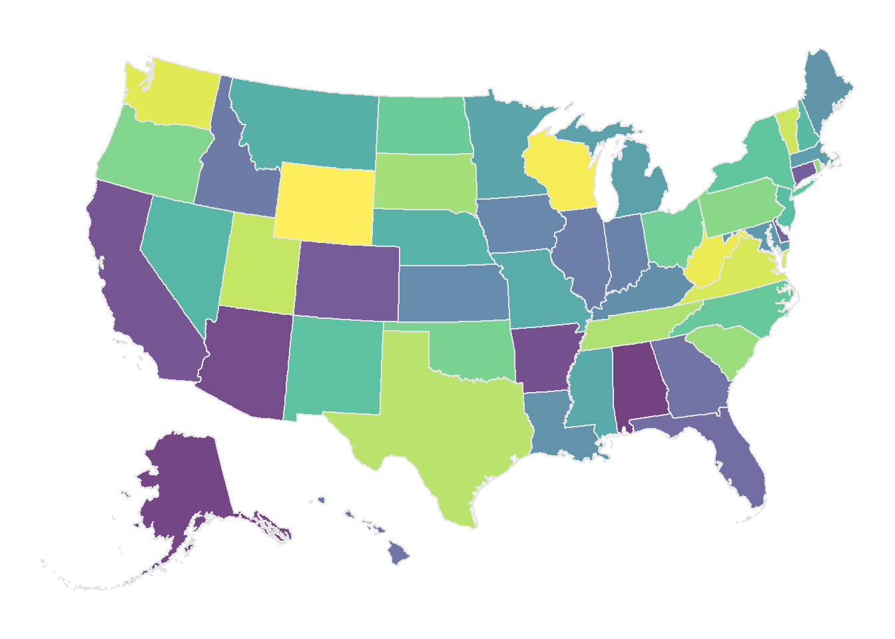

# State-Level Map with Alaska and Hawaii Shifted
## Based on Socviz Methodology

A current frustration in mapping state and county choropleth's in R is not having a map with Alaska and Hawaii inset next to the continental United States. This means you either have to show an accurate map with Alaska and Hawaii, which strethes the map greatly, or excise the states completely. As part of Kieran Healy's [Data Visualization](https://socviz.co/index.html#preface) a county level map of the United States, with Alaska and Hawaii shifted, was developed. This can be accessed in the **Socviz** package on CRAN. But no corresponding state-level map was developed. I use state-level maps for two purposes. The first is to map state-level data. The second is to overlay on top of county level data, in order to provide state borders.

Using the methodology laid out in **Data Visualization**, Appendix A.4, I have converted a state-level GeoJSON file into data frame containing all the necessary spatial data as well as the State FIPS code. Note that the method laid out by Kealy completely changes the latitude and longitude values. Meaning, if you were to use the county map in the **Socviz** package and then try to overlay an accurate state shapefile from another source, Tigris, perhaps, the two maps would not overlay. They would be in completley didfferent areas of the plot. Therefore, this state-level map is intended to be used either on its own, or only with the **Socviz** county map.